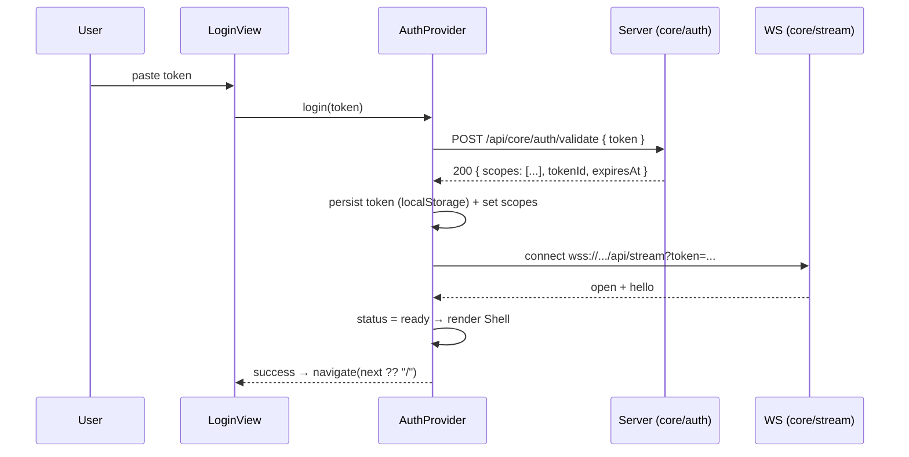
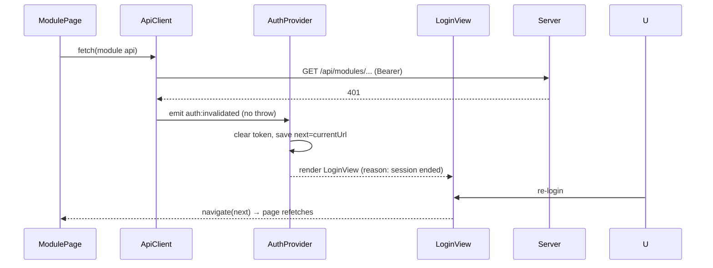

# Auth Flow

## 1. Model

- **Token-based (Bearer).** A token is a static string with a scope list,
  stored in local Redis on the backend (parent design §6). The shell's only
  job is to hold the token, present it on every request, and react to 401s.
- **One auth context** (`AuthProvider`) shared app-wide; every fetch and the
  WS connection draw from it.
- **Scope model:** `module.verb` (`inventory.read`), `admin` = `*`. The
  token's scope list arrives with validation and drives nav + route gating.

## 2. Login → shell (happy path)

## 3. Boot sequence (token already stored)

1. `AuthProvider` reads `localStorage["gsiv.token"]`. None → `login` view.
2. Validate against `/api/core/auth/validate` (fast, no per-page wait).
   - 200 → set scopes, connect WS, render shell.
   - 401/404 → clear token, show login with reason ("token expired or
     revoked").
   - Network error → **offline mode**: render shell degraded (see §7 and
     `states.md`), retry validation when connectivity returns.
3. The rest of the app (registry, pages) renders only after step 2 so every
   page can assume an authenticated context. The module manifest is loaded
   once and cached in `RegistryProvider`.

## 4. Token storage

| Concern | Decision |
|---|---|
| Storage | `localStorage["gsiv.token"]` — persists across reloads; logout clears it |
| Trade-off | XSS could read it; accepted for a self-hosted, private app; no third-party scripts loaded |
| Re-auth | re-entering a token, or picking from saved token list (v1 import, §6) |
| Multi-token | one active token at a time; token switcher in user menu |
| Expiry | tokens may carry `expiresAt`; shell checks it and pre-emptively prompts re-auth |

## 5. 401 handling mid-session

- The typed API client wraps every call; on `401` it does **not** throw to the
  page — it emits `auth:invalidated` on a tiny shell event bus.
- `AuthProvider` listens → clears token → shows `LoginView` (replacing the
  shell) with the current URL remembered as `next`.
- Pages never see a 401: they see either data or a "session ended" state.
- A 401 from a background poll (e.g. status strip) behaves the same — single
  code path, no per-module auth logic.
- WS close code `4001` (auth failed) → same `auth:invalidated` flow;
  reconnect only after re-login.

## 6. Reauth options

1. **Re-enter token** — primary path.
2. **Saved tokens** — the v1 token set imported at cutover (parent design §6)
   shown as a pick list (labels only, never the secret); select → validate →
   continue.
3. **Scope surfacing** — login view shows what scopes the accepted token
   grants and, when a module is missing, why (nav hides it).

## 7. Offline / connectivity

- WS drop without a `4001` close code = connectivity issue, not auth. The
  shell enters `degraded` (offline banner, `states.md`), keeps showing cached
  data, and retries WS with backoff. Auth state is untouched.
- Validation and API calls queue behind a retry; on recovery the shell
  re-validates and resumes.

## 8. Logout

`logout()` → clear token → close WS → `navigate("/login")`. Confirm dialog
for "Logout" in the user menu (irreversible until token re-entered). The
token itself is revoked server-side only by the `entry` module (admin
action) — shell logout is client-side by design.
