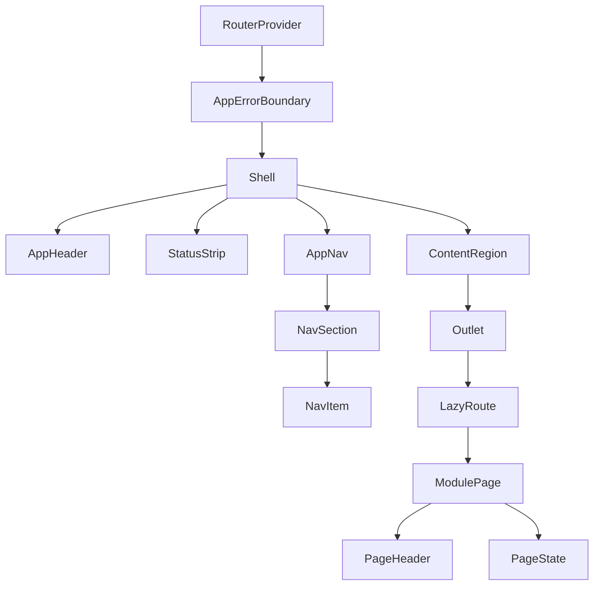

# Component Tree

## 1. Provider pyramid

```
<AppProviders>                      // composition root: wires providers in order
├─ <ErrorBoundaryProvider>          // top-level crash fence
├─ <AuthProvider>                   // token, scopes, login/logout, 401 bus
├─ <RegistryProvider>               // module manifest, nav model, scopes
├─ <WsProvider>                     // stream socket, status events, reconnect
├─ <ThemeProvider>                  // dark tokens (brief 02), sets <html data-theme>
├─ <ToastProvider>                  // shell toast queue
├─ <ModalProvider>                  // one modal outlet (confirm, token picker)
└─ <RouterProvider router={router}> // routes from registry (routing.md)
   └─ <AppErrorBoundary>            // per-route fence around Shell + pages
      └─ <Shell>
         ├─ <AppHeader>             // brand, pill, char switch, user menu
         ├─ <StatusStrip>           // WS/game/char truth + event ticker
         ├─ <AppNav>                // desktop rail | mobile drawer
         ├─ <ContentRegion>         // Suspense + <Outlet/>
         │   └─ <PageLoading> / <ModulePage> / <NotFoundPage> / ...
         └─ <AppFooter>
```

## 2. Component responsibilities & props

### `AuthProvider`
Owns the token, scope set, auth state machine (`unauthenticated → validating →
ready → invalidated`). Context value `useAuth()`:
```ts
{ status, token, scopes, can(...scopes): boolean,
  login(token): Promise<void>, logout(): void }
```

### `RegistryProvider`
Loads + validates the generated module manifest once; exposes the ordered nav
model and lookup helpers. Context `useRegistry()`:
```ts
{ manifest, navGroups, navItems, scopes, isLoading, error }
```

### `WsProvider`
Owns one `WebSocket` to `core/stream`; dispatches typed events
(`state`, `stream`, `module:<name>:*`) to subscribers. Exposes:
```ts
{ status: "connecting"|"open"|"reconnecting"|"offline",
  events: ReadableStream-ish hook, reconnect(), emit(topic, payload) }
```
WS events are the only thing that updates the StatusStrip live.

### `Shell`
Layout frame: grid rows `[header][status][nav+content][footer]`. No business
logic. Renders `<Outlet/>` inside `ContentRegion`.

| Component | Props | Responsibility |
|---|---|---|
| `AppHeader` | `{ onMenuClick, brand, user, tokenLabel, scopes }` | identity, primary actions, menu |
| `ConnectionPill` | `{ wsStatus, serverUp }` | click → detail popover |
| `StatusStrip` | `{ ws, server, characters, ticker }` | live truth, compact on mobile |
| `AppNav` | `{ items: NavItem[], activeId, collapsed, onNavigate }` | groups + items, keyboard nav |
| `NavSection` | `{ title, items, activeId }` | group label + its items |
| `NavItem` | `{ item, active }` | single link, icon, aria-current |
| `NavDrawer` | `{ open, onClose, items }` | mobile overlay, focus trap |
| `ContentRegion` | `{ children }` | Suspense + error boundary + page chrome |
| `PageHeader` | `{ title, subtitle, actions }` | consistent page title row |
| `PageState` | `{ kind: "loading"\|"empty"\|"error", message?, action?, detail? }` | shared states (`states.md`) |
| `LoginView` | `{ next, onLoggedIn }` | token entry + scope surfacing |
| `WatchButton` | `{ character, size }` | VellumFE deep link (`game-view-ux.md`) |
| `AppErrorBoundary` | `{ children, fallback? }` | crash → shell survives |

## 3. Container vs presentational split

- **Containers** (`AuthProvider`, `RegistryProvider`, `WsProvider`,
  `AppErrorBoundary`) hold state and effects; they render children.
- **Presentational** (`AppHeader`, `StatusStrip`, `AppNav`, `NavSection`,
  `NavItem`, `NavDrawer`, `PageHeader`, `PageState`, `AppFooter`) are pure;
  data comes in via props, events out via callbacks. Unit-testable with no
  hook mocking.

## 4. Page contract

A module page (`pages/<module>/index.tsx`) receives **nothing** from the
shell; it uses `useAuth()`, `useWs()`, and the typed API client. It is
responsible only for:

1. `PageHeader` with its title/actions,
2. rendering its data inside `PageState` primitives,
3. subscribing to its `module:*` WS events,
4. a `default` export for `LazyRoute`.

```
ModulePage (e.g. InventoryPage)
├─ <PageHeader title="Inventory" actions={[<Refresh/>]} />
├─ <PageState kind={state}>
│    loading → skeleton rows
│    empty   → "No inventory yet" + action
│    error   → message + Retry
│    ready   → <ItemTable rows={items} onRowClick={...} />
└─ <WsEvent sub="inventory:changed" onEvent={invalidate} />
```

## 5. Accessibility wiring

- `NavItem` renders `<a aria-current={active ? "page" : undefined}>`; the
  shell keeps focus in the nav when it re-renders items.
- Drawer uses `role="dialog" aria-modal="true"`, focus trap, `Escape` close.
- All icon-only elements carry `aria-label`.
- Reduced motion: skeleton shimmer and ticker animation gated on
  `prefers-reduced-motion`.

Mermaid:


