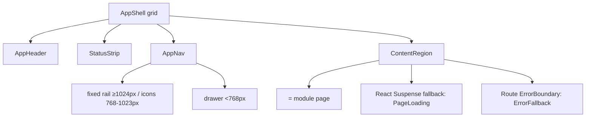

# Shell Layout

## 1. Anatomy

The shell is a fixed frame around a scrollable content region. Five zones,
in DOM/visual order:

1. **AppHeader** (56 px) — brand, primary actions, user menu. Never scrolls.
2. **StatusStrip** (28 px) — connection + game-world truth. Never scrolls.
3. **AppNav** — module navigation. Desktop: fixed left rail. Mobile: drawer.
4. **ContentRegion** — the module page; the only scrollable shell element.
5. **AppFooter** (24 px, hidden on mobile) — version, scope summary.

```
                 ┌────────────────────────────────────────────────────────┐
    Header (56)  │ ◆ GSIV        ●● online   👤 Winter ▾   ⚙   ✕         │
                 ├────────────────────────────────────────────────────────┤
   StatusStrip   │ ●WS ●Lich ●GameRoom    queue: 3 · healer idle     ▸   │
                 ├───────────┬────────────────────────────────────────────┤
                 │ ▒ Overview│                                            │
                 │   ◎ Dashboard        (ContentRegion — page scrolls)    │
                 │   📺 Game View       │                                │
                 │ ▒ Operations         │                                │
                 │   🎒 Inventory       │                                │
                 │   🎯 Bounty          │                                │
                 │   ⏳ Queue           │                                │
                 │   💎 Gems            │                                │
                 │   🫙 Jars            │                                │
                 │   ⛑ Healer          │                                │
   Nav (240 px)  │ ▒ Market             │                                │
                 │   🏷 Pricing         │                                │
                 │ ▒ People             │                                │
                 │   🧝 Characters      │                                │
                 │   👥 Accounts        │                                │
                 │ ▒ Platform           │                                │
                 │   🔑 Entry           │                                │
                 │   ⚙ Config           │                                │
                 │   📊 Analysis        │                                │
                 ├───────────┴────────────────────────────────────────────┤
    Footer       │ v0.1.0 · scopes: 13 read · docs · report issue          │
                 └────────────────────────────────────────────────────────┘
```

## 2. Zone responsibilities

| Zone | Desktop size | Role | Owns |
|---|---|---|---|
| AppHeader | 56 px tall | identity + global actions | brand, connection pill, character switch, user menu |
| StatusStrip | 28 px tall | always-visible system truth | WS state, game server state, online chars, live event ticker |
| AppNav | 240 px wide | navigation | groups, items, active state |
| ContentRegion | remainder | module page | Suspense, ErrorBoundary, page chrome |
| AppFooter | 24 px tall | provenance | version, scope summary |

## 3. Desktop (≥ 1024 px)

- Nav is a fixed left rail, always visible, 240 px wide.
- Rail can collapse to 56 px icon-only (`.nav--collapsed`) to give content
  more room; state persisted in `localStorage`; keyboard shortcut `[` toggles.
- Content region is fluid with a max column width of 1400 px, centered, with
  24 px side padding — dashboards do not need edge-to-edge.

```
┌────────────────────────────────────────────────────────────────┐
│ AppHeader (56px, sticky)                                       │
├──────┬─────────────────────────────────────────────────────────┤
│      │ StatusStrip (28px, sticky under header)                 │
│ Nav  ├─────────────────────────────────────────────────────────┤
│ 240px│ ContentRegion:                                          │
│      │  ┌─ PageHeader (title + actions) ────────────────────┐  │
│      │  │ module content (grids, tables, cards)             │  │
│      │  └──────────────────────────────────────────────────┘  │
├──────┴─────────────────────────────────────────────────────────┤
│ Footer (24px)                                                  │
└────────────────────────────────────────────────────────────────┘
```

## 4. Mobile (< 768 px)

- Nav becomes a **drawer** overlaying content from the left; hamburger `☰` in
  the header opens it. Drawer: 300 px, scrim behind, `Escape` / scrim-tap
  close, focus trapped while open, `aria-expanded` on the trigger. The drawer
  doubles as a bottom-sheet-style list for one-handed use.
- StatusStrip condenses to a single tap-to-expand row of status dots
  (`●●● ▸`); the expanded panel shows detail plus quick "Watch" actions.
- Page headers gain a sticky back affordance when navigating depth
  (`/characters/:charId`).

```
┌──────────────────────────┐
│ ☰  ◆ GSIV      ● ● ● ▸ 👤│ ← AppHeader (compact)
├──────────────────────────┤
│ ●WS ●Lich ●Room    queue:3│ ← StatusStrip (compact, 24px)
├──────────────────────────┤
│ ContentRegion            │
│  ┌─ PageHeader ────────┐ │
│  │ module content      │ │
│  └─────────────────────┘ │
│               [ ⏶ ]      │ ← scroll-to-top / back affordance
└──────────────────────────┘

Drawer (open):
┌──────────┬─────────────┐
│ ▒Overview│   (scrim)   │
│   ◎ Dash │             │
│   📺 Game│             │
│ ▒Ops ... │             │
└──────────┴─────────────┘
```

## 5. Breakpoints

| Range | Nav | Header | StatusStrip |
|---|---|---|---|
| ≥ 1024 px | fixed rail (240 px, collapsible to 56 px) | full | full |
| 768–1023 px | rail auto-collapsed to 56 px icons; expands on hover/focus | full | full |
| < 768 px | drawer (300 px overlay) | compact | compact, tap-to-expand |

## 6. Content region contract

Every module page renders inside `ContentRegion` and must:

- use the shared `PageHeader` (title, subtitle, primary actions),
- wrap body content in `PageState` primitives (`states.md`),
- never render its own full-page chrome — that is the shell's job.

Mermaid summary of the frame:


