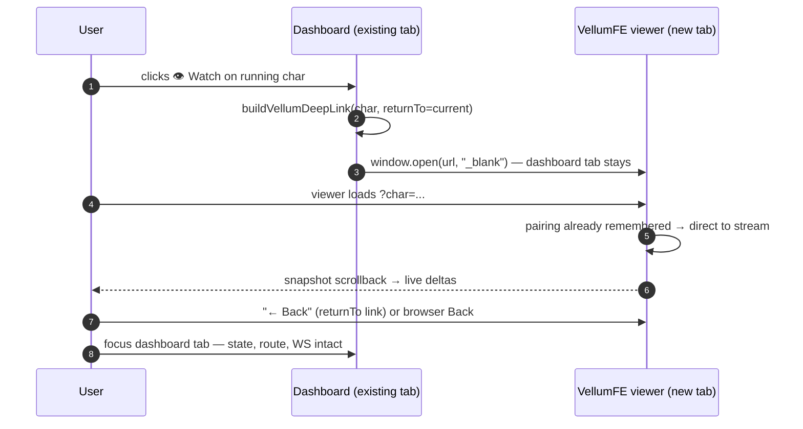
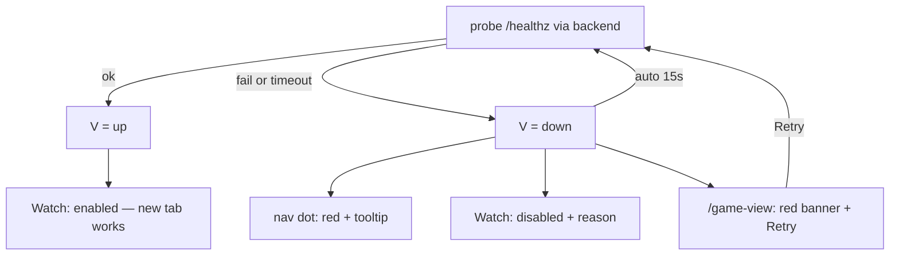
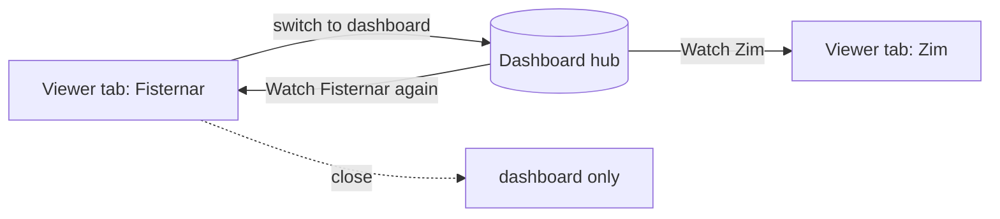
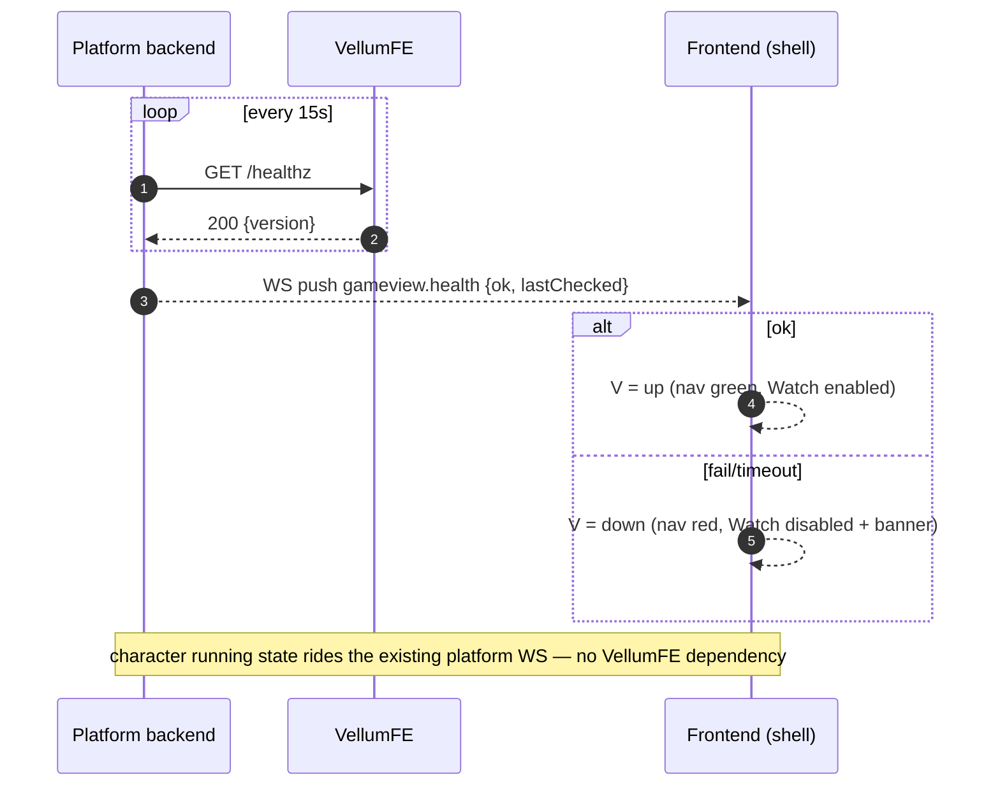

# Flow — Game View user journeys

All flows assume: viewer `up`, new-tab handoff, health/character state from platform WS. Variants (down, pairing, multi-char) are separate flows below.

## 1. Dashboard → Watch → view → back (happy path)

### ASCII

```
┌────────── dashboard tab ──────────┐        ┌────────── viewer tab (new) ──────────┐
│ Characters page                   │        │ VellumFE web UI                     │
│  [Fisternar  running  👁 Watch]   │        │  ?char=Fisternar                     │
│         │ click                   │        │                                     │
│         ▼                         │        │   live stream:                       │
│  buildVellumDeepLink(Fisternar)   │        │   snapshot → deltas → scrollback    │
│  window.open(url, _blank)         │        │            │                         │
│         │                    ┌────┴───────►│            │                         │
│  tab stays alive, state kept  │            │  user is done                        │
│  WS still connected           │            │  clicks "← Back" (returnTo)          │
│  (no reload, no re-auth)      │            │        or browser Back ──► dashboard │
│         ▲                     └────────────┴───────────┘                          │
│  user switches back to the dashboard tab — instant, unchanged                     │
└───────────────────────────────────┘
```

### Mermaid



## 2. Viewer down — no broken tab, recovery at every entry point

```
          probe fails / timeout
   ┌───────────────────────────────────┐
   ▼                                   │
 viewer = down ◄───────────────────────┘  (auto-reprobe every 15s)
   │
   ├─► nav dot ▸ red, tooltip "viewer offline"
   ├─► Watch button ▸ disabled, reason tooltip "Viewer offline — retry"
   ├─► /game-view   ▸ red banner + Retry + lastChecked
   │
   └─► user presses Retry ──► probe ──► up? ──► green, Watch enabled
                                        └─► down? ──► banner stays, auto-retry continues
```



## 3. First-time pairing (auth handoff)

```
 1st visit                  dashboard                            viewer
 ─────────                  ─────────                            ──────
                            "First visit? You'll pair once
                             in the viewer." (hint chip)
 click Watch ──────────────► open ?char=Fisternar&returnTo=… ──► pairing screen
                                                                  (no session yet)
 user enters pairing token (or otp prefill, future) ───────────► token verified
                                                                  session stored (A2)
                                                                  live view
 "← Back" ────────────────► back to dashboard (returnTo) ───────────────┘
 2nd visit                  click Watch ──► ?char=… ──► straight to live view
```

```mermaid
sequenceDiagram
  autonumber
  participant D as Dashboard
  participant V as VellumFE
  U->>D: Watch (first visit)
  D->>V: open ?char=Fisternar&returnTo=…
  V-->>U: pairing screen (no session)
  U->>V: enter pairing token
  V-->>U: live view; VellumFE remembers pairing
  U->>D: "← Back" → dashboard tab, state intact
  Note over D,V: subsequent deep links skip pairing (A2)
```

## 4. Multi-character switching

**Split of responsibility (recommended):** the **dashboard is the hub** — every list of characters carries a Watch; the **viewer is a single-character viewport**. Switching happens back in the dashboard: one tab per character, or close/replace. The dashboard does **not** ask VellumFE for a session-switching API, and VellumFE does **not** need a character-list UI.

```
user watching Fisternar (tab A)
        │
        │ wants to watch Zim too
        ▼
switch to dashboard tab ──► Game View page (or strip)
        │
        ├─► Watch Zim ──► tab B (Fisternar tab stays live)
        │
        └─► or close tab A, then Watch Zim ──► one viewer tab

consistency rule: one character per link (deep-link contract §1);
                   the dashboard never guesses "current character".
```



If the viewer later adds its own "switch character" UI, that's VellumFE's feature — the dashboard's per-character link contract still holds, so the platform gains nothing extra to build.

## 5. Health + state loop (the seam's only live traffic)



## Reading order

1. Happy path (§1) — establishes the new-tab model.
2. Viewer down (§2) — the states that matter operationally.
3. Pairing (§3) — the auth handoff.
4. Multi-char (§4) — the hub/viewport split.
5. Health loop (§5) — the only integration surface.
